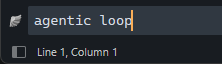
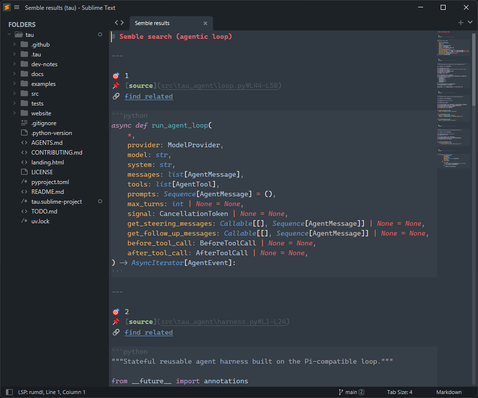
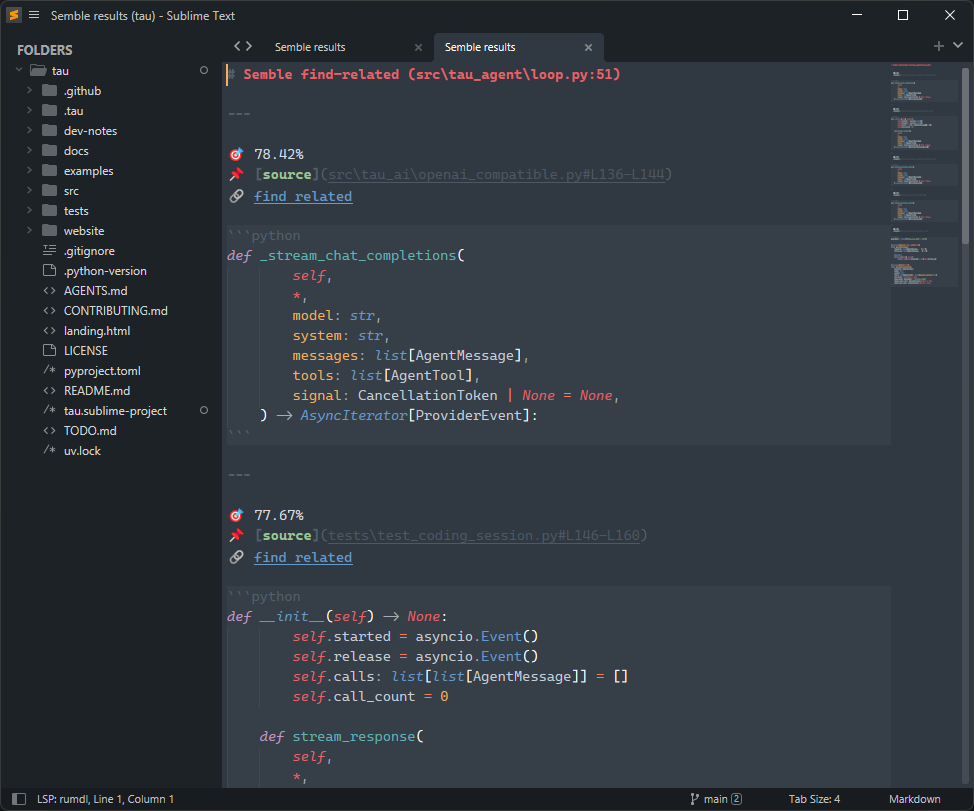

# 🪽 Semble

A [Sublime Text](https://www.sublimetext.com/) plugin that integrates the [`semble`](https://github.com/MinishLab/semble) CLI tool for semantic code search and related-code discovery directly in your editor.

## Features

- **Semantic search** — query your code-base in natural language via the `semble search` CLI
- **Find related** — discover semantically related code snippets
- Results open in a dedicated scratch view rendered as Markdown with syntax-highlighted code blocks
- Inline **"find related"** phantom links on each result for one-click chaining

## Requirements

- Sublime Text 4
- [`semble`](https://github.com/MinishLab/semble) CLI installed and on your `PATH` (`uv tool install semble`)
- An open Sublime Text **project** (`.sublime-project`)

## Installation

1. Clone or copy this package into your Sublime Text `Packages/` directory:

```shell
git clone https://github.com/debjan/sublime-semble Semble
```

2. Restart Sublime Text.

## Usage

### Semantic search

Open the Command Palette (`Ctrl+Shift+P` / `Cmd+Shift+P`) and type **Semble**. Run the search command and input panel appears:



Then type your query and press Enter



### Find related

From the Command Palette, run **Semble: Find Related** to find code related to the current cursor position. You can also click the 🔗 **find related** link that appears beneath any result in the results view to chain searches.



Results appear in a **Semble results** tab showing:

- 🎯 Rank (search) or cosine similarity score (find-related)
- 📌 Source file and line range
- 🔗 Find-related link
- Syntax-highlighted code block

## Notes

- The plugin is only active when a project is open and `semble` is on your `PATH`. The command is hidden otherwise.
- **source** links can be opened in various ways in Sublime, while I'd suggest using `rumdl` LSP plugin
